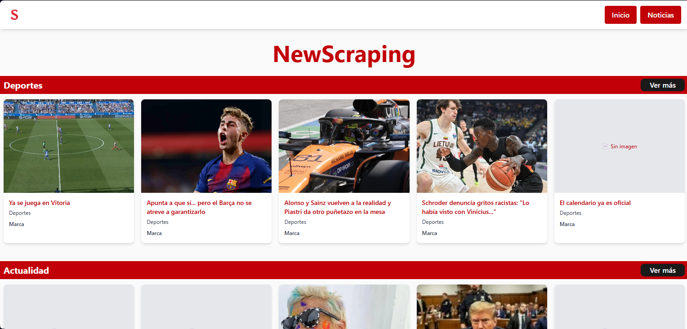

<h1 align="center"> NewScraping </h1>
<p align="center">
  
</p>

<p align="center">
  
  
</p>

## Introduction
Website that gathers sports and current news from major Spanish newspapers using web scraping.

<p align="center">
  
</p>

## Installation 🛠️

First, clone the repository and run the back-end.

```bash
git clone https://github.com/JaimeGarciaRedondo/NewScraping.git
cd NewScraping/backend
```

Then, create a venv and install the `requirements.txt`.

```bash
python -m venv venv
source venv/bin/activate   # on Linux/Mac
venv\Scripts\activate      # on Windows
pip install -r requirements.txt
```

And start the API.

```bash
python api.py
```

Now, let's start the front-end and install its npm dependencies.

```bash
cd ../frontend
npm install
```

Create a `.env` file and start the front-end.
```bash
echo VITE_API_URL=http://localhost:8000 > .env
npm run dev
```

## Technologies Used ✅
- Python
- JavaScript
- CSS
- HTML

## Contributors 👤
[](https://github.com/JaimeGarciaRedondo)

## License
NewScraping is [MIT Licensed](LICENSE).
